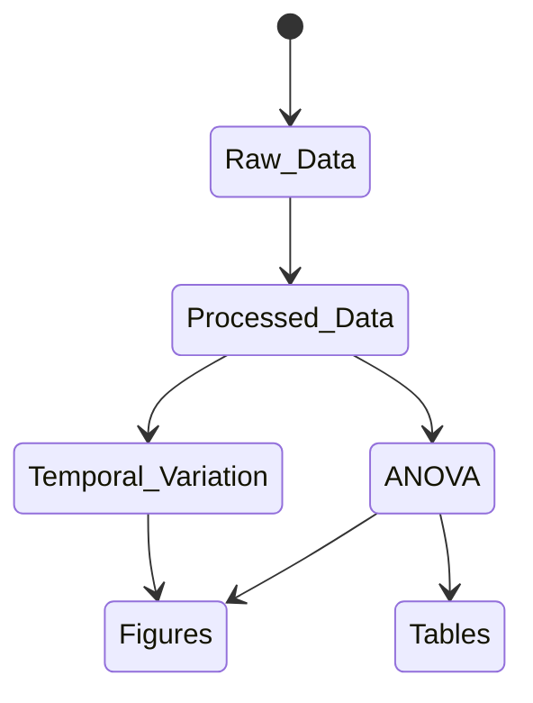

<!-- README.md is generated from README.Rmd. Please edit that file -->

```{r, include = FALSE}
knitr::opts_chunk$set(
  collapse = TRUE,
  comment = "#>"
)
```

# Stroud_Preserve

<!-- badges: start -->
<!-- badges: end -->

The goal of Stroud_Preserve is to ...

## Process Flow Diagram
<!-- Source for idea: -->
<!-- https://twitter.com/diegohaz/status/1590043504428077056 -->


## Description of scripts within this repository: 
 * ./r/Prepare_Data.R - imports the various raw data files in ./data/ and prepares them for use with the remaining (analytical) scripts in this repo  
 * ./r/Sampling_Table.R - creates a .csv file with the sample counts by sampling date and analysis type  
 * ./r/seasonality.R - generates figures illustrating how parameter values ... erm... vary over the course of the year
 * ./r/boxplots.R - generates boxplots 
 * ./r/eea.R - creates eea ratio plots 
 * ./r/anova.R - carries out hypothesis tests
 * ./r/weather_station.R - produces visualizations and summary statistics from weather station data 

## Reproducing the Results
In order to reproduce our findings or view our approach...

### ANOVA
In order to generate our ANOVA results, execute the following line in the project's root directory. 

```{bash, eval = FALSE}
bash ./src/anova_script.sh
```


What is special about using `README.Rmd` instead of just `README.md`? You can include R chunks like so:

```{r cars}
summary(cars)
```

You'll still need to render `README.Rmd` regularly, to keep `README.md` up-to-date. `devtools::build_readme()` is handy for this. You could also use GitHub Actions to re-render `README.Rmd` every time you push. An example workflow can be found here: <https://github.com/r-lib/actions/tree/master/examples>.

You can also embed plots, for example:

```{r pressure, echo = FALSE}
plot(pressure)
```

In that case, don't forget to commit and push the resulting figure files, so they display on GitHub.
