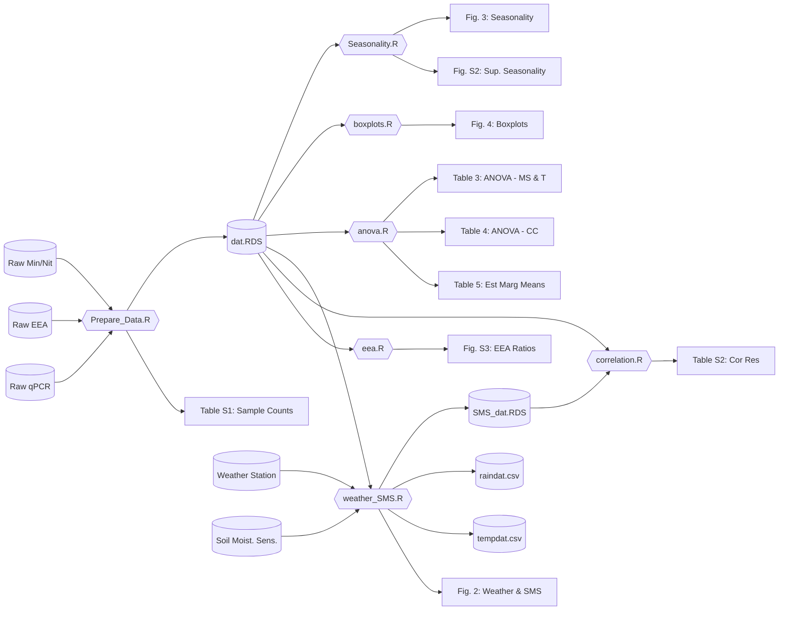

<!-- README.md is generated from README.Rmd. Please edit that file -->

```{r, include = FALSE}
knitr::opts_chunk$set(
  collapse = TRUE,
  comment = "#>"
)
```

# Reduction in nitrification during the early transition from conventional to organic farming practices

## Introduction

This repository contains all of the scripts needed to replicate the results and output presented in: 

[Jacob R. Price](https://jacobrprice.github.io/), [Diana Oviedo-Vargas](https://stroudcenter.org/people/oviedo-vargas/), [Marc Peipoch](https://stroudcenter.org/people/peipoch/), [Melinda D. Daniels](https://stroudcenter.org/people/daniels/), & [Jinjun Kan](https://stroudcenter.org/people/kan/). 2025. Reduction in nitrification during the early transition from conventional to organic farming practices. Ecosphere. (DOI forthcoming)

**Note(s):**   

* These scripts were composed and executed on Mac machines; some modification may be required for use with PC or Linux environments. 


## Process Flow Chart   
*If you can't see the chart make your browser wider and reload the page.* 

<!-- Syntax: -->
<!-- https://mermaid.js.org/syntax/flowchart.html -->
<!-- live editor: -->
<!-- https://mermaid-js.github.io/mermaid-live-editor/ -->

## Repository Contents
* ./ - the project home directory; where you're currently located :-)   
* ./README.Rmd & ./README.md - what you're reading at the moment  
* ./data/ - contains all of the raw data needed to replicate our analysis and processed data in case you just want to look at the results themselves  
* ./src/ - contains all of the (R) source files  
